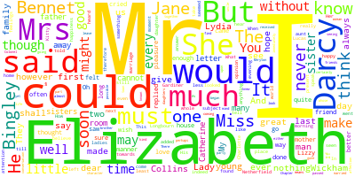

# pride-and-prejudice

### Introduction
This project applies NLP on the book of Pride and Prejudice by Jane Austen.

#### Libraries
- [`nltk`](https://www.nltk.org/)
- [`wordcloud`](https://amueller.github.io/word_cloud/)

#### References
- Data: [https://www.gutenberg.org/ebooks/1342](https://www.gutenberg.org/ebooks/1342)
